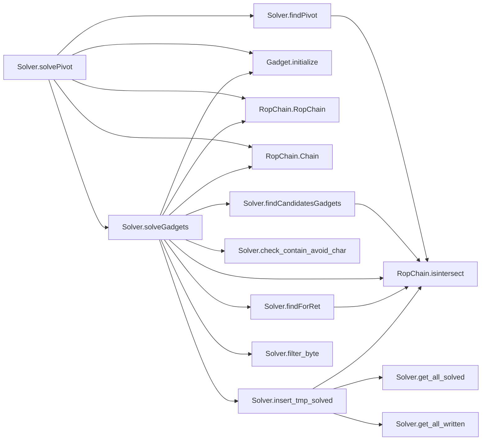
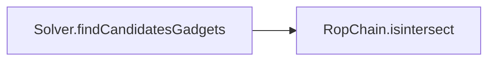
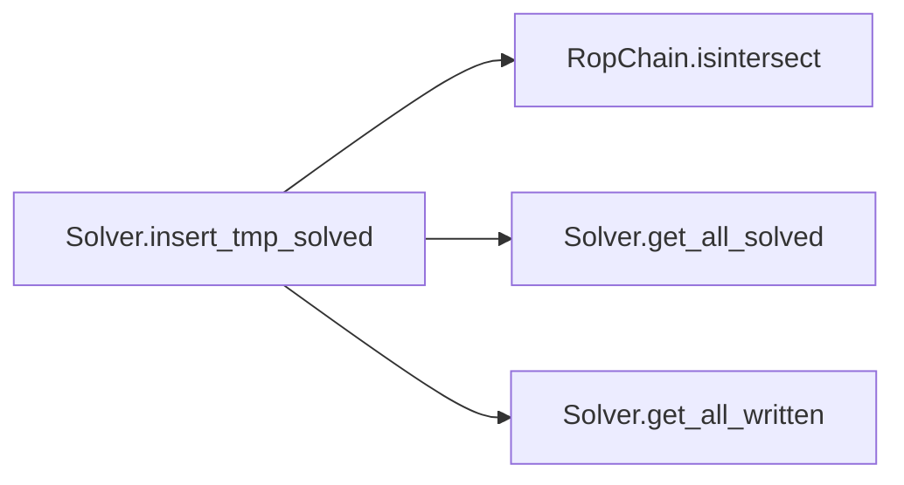
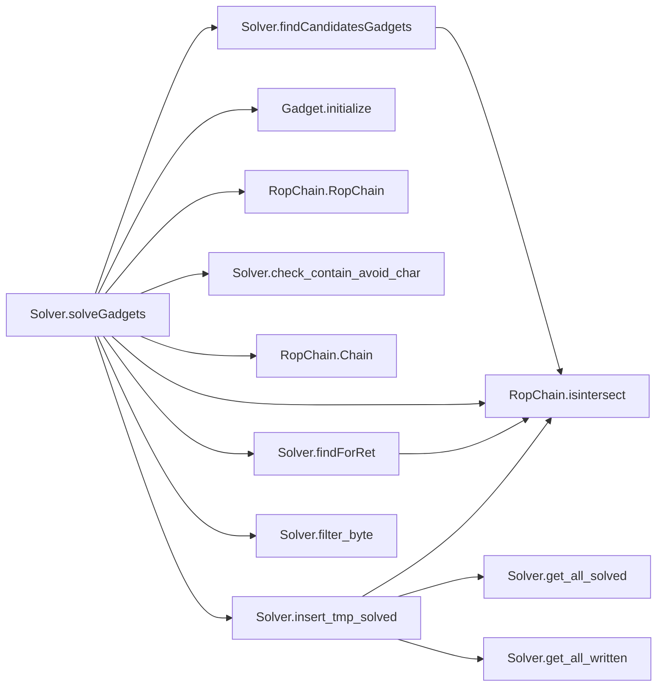
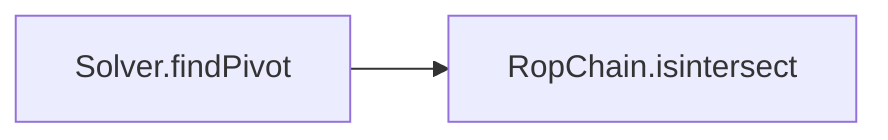
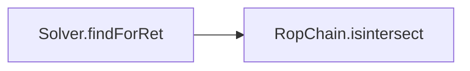
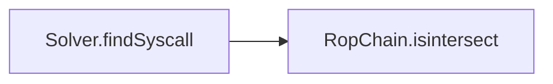
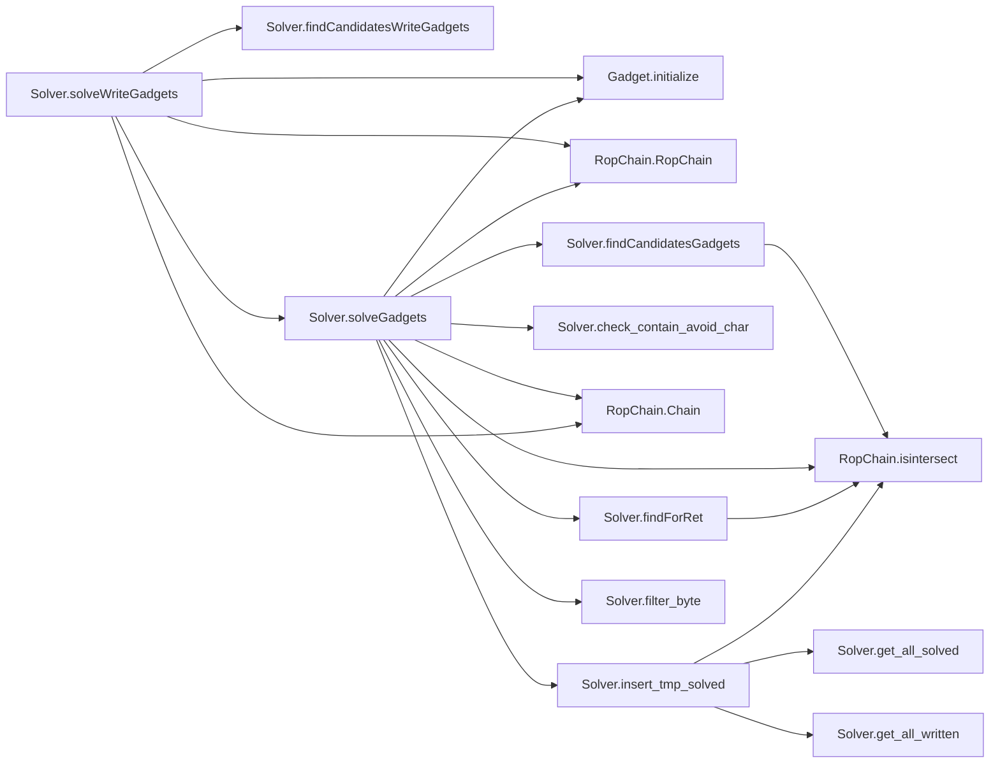

# Key Objects

[_Documentation generated by Documatic_](https://www.documatic.com)

<!---Documatic-section-Solver.solvePivot-start--->
## Solver.solvePivot

<!---Documatic-section-solvePivot-start--->


### Object Calls

* Solver.findPivot
* Gadget.initialize
* RopChain.RopChain
* RopChain.Chain
* Solver.solveGadgets

<!---Documatic-block-Solver.solvePivot-start--->
<details>
	<summary><code>Solver.solvePivot</code> code snippet</summary>

```python
def solvePivot(gadgets, addr_pivot, avoid_char=None):
    regs = ['rax', 'rbx', 'rcx', 'rdx', 'rsi', 'rdi', 'rbp', 'r8', 'r9', 'r10', 'r11', 'r12', 'r13', 'r14', 'r15']
    candidates = findPivot(gadgets, avoid_char=avoid_char)
    ctx = initialize()
    chains = RopChain()
    for gadget in candidates:
        if not gadget.is_asted:
            gadget.buildAst()
        hasil = ctx.getModel(gadget.pivot_ast == addr_pivot).values()
        for v in hasil:
            alias = v.getVariable().getAlias()
            refind_dict = dict()
            if 'STACK' not in alias:
                if alias in regs and alias not in refind_dict:
                    refind_dict[alias] = v.getValue()
                else:
                    hasil = False
                    break
            else:
                idxchain = int(alias.replace('STACK', ''))
                new_diff_sp = (idxchain + 1) * 8
        if hasil and refind_dict:
            hasil = solveGadgets(gadgets[:], refind_dict, avoid_char=avoid_char)
            new_diff_sp = 0
        if not hasil:
            continue
        gadget.diff_sp = new_diff_sp
        chain = Chain()
        chain.set_solved(gadget, [hasil])
        chains.insert_chain(chain)
        return chains
```
</details>
<!---Documatic-block-Solver.solvePivot-end--->
<!---Documatic-section-solvePivot-end--->

# #
<!---Documatic-section-Solver.solvePivot-end--->

<!---Documatic-section-Gadget.symbolizeReg-start--->
## Gadget.symbolizeReg

<!---Documatic-section-symbolizeReg-start--->
<!---Documatic-block-Gadget.symbolizeReg-start--->
<details>
	<summary><code>Gadget.symbolizeReg</code> code snippet</summary>

```python
def symbolizeReg(ctx, regname):
    tmp = ctx.symbolizeRegister(getattr(ctx.registers, regname))
    tmp.setAlias(regname)
```
</details>
<!---Documatic-block-Gadget.symbolizeReg-end--->
<!---Documatic-section-symbolizeReg-end--->

# #
<!---Documatic-section-Gadget.symbolizeReg-end--->

<!---Documatic-section-Solver.get_all_written-start--->
## Solver.get_all_written

<!---Documatic-section-get_all_written-start--->
<!---Documatic-block-Solver.get_all_written-start--->
<details>
	<summary><code>Solver.get_all_written</code> code snippet</summary>

```python
def get_all_written(tmp_solved):
    written_regs = set()
    for solved in tmp_solved:
        written_regs.update(solved.get_written_regs())
    return written_regs
```
</details>
<!---Documatic-block-Solver.get_all_written-end--->
<!---Documatic-section-get_all_written-end--->

# #
<!---Documatic-section-Solver.get_all_written-end--->

<!---Documatic-section-Solver.initialize-start--->
## Solver.initialize

<!---Documatic-section-initialize-start--->
<!---Documatic-block-Solver.initialize-start--->
<details>
	<summary><code>Solver.initialize</code> code snippet</summary>

```python
def initialize():
    ctx = TritonContext()
    ctx.setArchitecture(ARCH.X86_64)
    ctx.setMode(MODE.ALIGNED_MEMORY, True)
    ctx.setAstRepresentationMode(AST_REPRESENTATION.PYTHON)
    return ctx
```
</details>
<!---Documatic-block-Solver.initialize-end--->
<!---Documatic-section-initialize-end--->

# #
<!---Documatic-section-Solver.initialize-end--->

<!---Documatic-section-Solver.check_contain_avoid_char-start--->
## Solver.check_contain_avoid_char

<!---Documatic-section-check_contain_avoid_char-start--->
<!---Documatic-block-Solver.check_contain_avoid_char-start--->
<details>
	<summary><code>Solver.check_contain_avoid_char</code> code snippet</summary>

```python
def check_contain_avoid_char(regvals, avoid_char):
    for char in avoid_char:
        for val in regvals:
            if isinstance(val, str):
                continue
            valb = val.to_bytes(8, 'little')
            if char in valb:
                return True
    return False
```
</details>
<!---Documatic-block-Solver.check_contain_avoid_char-end--->
<!---Documatic-section-check_contain_avoid_char-end--->

# #
<!---Documatic-section-Solver.check_contain_avoid_char-end--->

<!---Documatic-section-Solver.filter_byte-start--->
## Solver.filter_byte

<!---Documatic-section-filter_byte-start--->
<!---Documatic-block-Solver.filter_byte-start--->
<details>
	<summary><code>Solver.filter_byte</code> code snippet</summary>

```python
def filter_byte(astctxt, bv, bc, bsize):
    nbv = []
    for i in range(bsize):
        nbv.append(astctxt.lnot(astctxt.equal(astctxt.extract(i * 8 + 7, i * 8, bv), astctxt.bv(bc, 8))))
    return nbv
```
</details>
<!---Documatic-block-Solver.filter_byte-end--->
<!---Documatic-section-filter_byte-end--->

# #
<!---Documatic-section-Solver.filter_byte-end--->

<!---Documatic-section-Solver.findCandidatesGadgets-start--->
## Solver.findCandidatesGadgets

<!---Documatic-section-findCandidatesGadgets-start--->


### Object Calls

* RopChain.isintersect

<!---Documatic-block-Solver.findCandidatesGadgets-start--->
<details>
	<summary><code>Solver.findCandidatesGadgets</code> code snippet</summary>

```python
def findCandidatesGadgets(gadgets, regs_write, regs_items, not_write_regs=set(), avoid_char=None, cand_write_first=False):
    candidates_pop = []
    candidates_write = []
    candidates_depends = []
    candidates_defined = []
    candidates_defined2 = []
    candidates_no_return = []
    candidates_for_ret = []
    depends_regs = set()
    for gadget in list(gadgets):
        if isintersect(not_write_regs, gadget.written_regs) or gadget.is_memory_read or gadget.is_memory_write or (gadget.end_type in [TYPE_UNKNOWN, TYPE_JMP_MEM, TYPE_CALL_MEM]):
            gadgets.remove(gadget)
            continue
        badchar = False
        if avoid_char:
            for char in avoid_char:
                addrb = gadget.addr.to_bytes(8, 'little')
                if char in addrb:
                    badchar = True
                    break
        if badchar:
            continue
        if isintersect(regs_write, set(gadget.defined_regs.keys())):
            if regs_items and isintersect(regs_items, set(gadget.defined_regs.items())):
                candidates_defined2.append(gadget)
            else:
                candidates_defined.append(gadget)
            gadgets.remove(gadget)
            depends_regs.update(gadget.depends_regs)
            continue
        if isintersect(regs_write, gadget.popped_regs):
            candidates_pop.append(gadget)
            gadgets.remove(gadget)
            depends_regs.update(gadget.depends_regs)
            continue
        if isintersect(regs_write, gadget.written_regs):
            candidates_write.append(gadget)
            gadgets.remove(gadget)
            depends_regs.update(gadget.depends_regs)
            continue
    if depends_regs:
        candidates_depends = findCandidatesGadgets(gadgets, depends_regs, set(), not_write_regs)
    if cand_write_first:
        candidates = candidates_write + candidates_defined2 + candidates_pop + candidates_defined + candidates_depends
    else:
        candidates = candidates_defined2 + candidates_pop + candidates_defined + candidates_write + candidates_no_return + candidates_depends
    for gadget in gadgets:
        if gadget.diff_sp in [8, 0]:
            candidates_for_ret.append(gadget)
            gadgets.remove(gadget)
    candidates += candidates_for_ret
    return candidates
```
</details>
<!---Documatic-block-Solver.findCandidatesGadgets-end--->
<!---Documatic-section-findCandidatesGadgets-end--->

# #
<!---Documatic-section-Solver.findCandidatesGadgets-end--->

<!---Documatic-section-Solver.insert_tmp_solved-start--->
## Solver.insert_tmp_solved

<!---Documatic-section-insert_tmp_solved-start--->


### Object Calls

* RopChain.isintersect
* Solver.get_all_solved
* Solver.get_all_written

<!---Documatic-block-Solver.insert_tmp_solved-start--->
<details>
	<summary><code>Solver.insert_tmp_solved</code> code snippet</summary>

```python
def insert_tmp_solved(tmp_solved, solved):
    intersect = False
    if isintersect(solved.get_written_regs(), get_all_solved(tmp_solved)):
        intersect = True
    if intersect and len(tmp_solved) > 0:
        for i in range(len(tmp_solved) - 1, -1, -1):
            solved_before = get_all_solved(tmp_solved[:i + 1])
            if isintersect(solved.get_solved_regs(), tmp_solved[i].get_written_regs()) and (not isintersect(solved_before, solved.get_written_regs())):
                tmp_solved.insert(i + 1, solved)
                break
            regs_used_after = get_all_written(tmp_solved)
            if i == 0:
                if not isintersect(solved.get_solved_regs(), regs_used_after):
                    tmp_solved.insert(0, solved)
                else:
                    return False
    else:
        tmp_solved.append(solved)
    return True
```
</details>
<!---Documatic-block-Solver.insert_tmp_solved-end--->
<!---Documatic-section-insert_tmp_solved-end--->

# #
<!---Documatic-section-Solver.insert_tmp_solved-end--->

<!---Documatic-section-Solver.extract_byte-start--->
## Solver.extract_byte

<!---Documatic-section-extract_byte-start--->
<!---Documatic-block-Solver.extract_byte-start--->
<details>
	<summary><code>Solver.extract_byte</code> code snippet</summary>

```python
def extract_byte(bv, pos):
    return bv >> pos * 8 & 255
```
</details>
<!---Documatic-block-Solver.extract_byte-end--->
<!---Documatic-section-extract_byte-end--->

# #
<!---Documatic-section-Solver.extract_byte-end--->

<!---Documatic-section-Gadget.getTritonReg-start--->
## Gadget.getTritonReg

<!---Documatic-section-getTritonReg-start--->
<!---Documatic-block-Gadget.getTritonReg-start--->
<details>
	<summary><code>Gadget.getTritonReg</code> code snippet</summary>

```python
def getTritonReg(ctx, regname):
    return getattr(ctx.registers, regname)
```
</details>
<!---Documatic-block-Gadget.getTritonReg-end--->
<!---Documatic-section-getTritonReg-end--->

# #
<!---Documatic-section-Gadget.getTritonReg-end--->

<!---Documatic-section-RopChain.Chain-start--->
## RopChain.Chain

<!---Documatic-section-Chain-start--->
<!---Documatic-block-RopChain.Chain-start--->
<details>
	<summary><code>RopChain.Chain</code> code snippet</summary>

```python
class Chain(object):

    def __init__(self):
        self.written_regs = set()
        self.solved_regs = set()
        self.depends_regs = set()
        self.gadget = None
        self.chain_values = []

    def set_chain_values(self, chain_values):
        self.chain_values = chain_values

    def set_solved(self, gadget, values, regs=set(), written_regs=set(), depends_regs=set()):
        self.solved_regs.update(regs)
        self.written_regs.update(gadget.written_regs)
        self.written_regs.update(written_regs)
        self.depends_regs.update(depends_regs)
        self.gadget = gadget
        depends_chain_values = []
        chain_values = [ChainItem(0)] * (gadget.diff_sp // 8 + 1)
        chain_values[0] = ChainItem(gadget.addr, 0, str(gadget), CHAINITEM_TYPE_ADDR)
        for chain_item in values:
            if isinstance(chain_item, RopChain):
                self.written_regs.update(chain_item.get_written_regs())
                self.depends_regs.update(chain_item.get_depends_regs())
                depends_chain_values += chain_item.get_chains()
                continue
            if chain_item:
                chain_values[chain_item.idx_chain] = chain_item
        self.chain_values += depends_chain_values + chain_values
        if gadget.end_gadget:
            self.written_regs.update(gadget.end_gadget.written_regs)

    def get_chains(self):
        return self.chain_values

    def get_written_regs(self):
        return self.written_regs

    def get_solved_regs(self):
        return self.solved_regs

    def dump(self, sp, base_addr=0):
        chains = self.get_chains()
        dump_str = ''
        for i in range(len(chains)):
            chain = chains[i]
            com = ''
            if chain.comment:
                com = ' # {}'.format(chain.comment)
            dump_str += '$RSP+0x{:04x} : 0x{:016x}{}\n'.format(sp, chain.getValue(base_addr), com)
            sp += 8
        print(dump_str, end='')
        return sp

    def payload_str(self, base_addr=0):
        chains = self.get_chains()
        payload = b''
        for i in range(len(chains)):
            chain = chains[i]
            payload += chain.getValue(base_addr).to_bytes(8, 'little')
        return payload

    def __repr__(self):
        return 'written_regs : {}\nsolved_regs: {}\n'.format(self.written_regs, self.solved_regs)

    def __str__(self):
        return 'written_regs : {}\nsolved_regs: {}\n'.format(self.written_regs, self.solved_regs)
```
</details>
<!---Documatic-block-RopChain.Chain-end--->
<!---Documatic-section-Chain-end--->

# #
<!---Documatic-section-RopChain.Chain-end--->

<!---Documatic-section-RopChain.RopChain-start--->
## RopChain.RopChain

<!---Documatic-section-RopChain-start--->
<!---Documatic-block-RopChain.RopChain-start--->
<details>
	<summary><code>RopChain.RopChain</code> code snippet</summary>

```python
class RopChain(object):

    def __init__(self):
        self.chains = []
        self.dump_str = None
        self.payload = b''
        self.base_addr = 0
        self.next_call = None
        self.is_noreturn = False

    def merge_ropchain(self, ropchain):
        assert not self.is_noreturn, "can't merge ropchain, this chain is no-return"
        assert isinstance(ropchain, RopChain), 'not RopChain instance'
        if self.next_call:
            self.append(self.next_call)
        for chain in ropchain.chains:
            self.append(chain)
        self.next_call = ropchain.next_call

    def __add__(self, ropchain):
        self.merge_ropchain(ropchain)
        return self

    def set_next_call(self, addr, type_val=0, comment=''):
        chain = Chain()
        chain.set_chain_values([ChainItem(addr, type_val, comment)])
        self.next_call = chain

    def set_base_addr(self, addr):
        self.base_addr = addr

    def insert(self, idx, chain):
        self.chains.insert(idx, chain)

    def append(self, chain):
        self.chains.append(chain)

    def insert_chain(self, chain):
        intersect = False
        if isintersect(chain.written_regs, set(self.get_solved_regs())):
            intersect = True
        if intersect and len(self.chains) > 0:
            for i in range(len(self.chains) - 1, -1, -1):
                solved_before = set(self.get_solved_regs(0, i + 1))
                written_before = set(self.get_written_regs(0, i + 1))
                if isintersect(chain.solved_regs, self.chains[i].written_regs) and (not isintersect(solved_before, chain.written_regs)):
                    self.insert(i + 1, chain)
                    break
                if i == 0:
                    regs_used_after = set(self.get_written_regs())
                    depends_regs_after = set(self.get_depends_regs())
                    if not isintersect(chain.solved_regs, regs_used_after) and (not isintersect(chain.written_regs, depends_regs_after)):
                        self.insert(0, chain)
                    else:
                        return False
        else:
            self.append(chain)
        return True

    def get_solved_regs(self, start_chain=None, end_chain=None):
        regs_solved = set()
        chains = self.chains[start_chain:end_chain]
        for chain in chains:
            regs_solved.update(chain.solved_regs)
        return regs_solved

    def get_written_regs(self, start_chain=None, end_chain=None):
        regs_written = set()
        chains = self.chains[start_chain:end_chain]
        for chain in chains:
            regs_written.update(chain.written_regs)
        return regs_written

    def get_depends_regs(self, start_chain=None, end_chain=None):
        regs_depends = set()
        chains = self.chains[start_chain:end_chain]
        for chain in chains:
            regs_depends.update(chain.depends_regs)
        return regs_depends

    def get_chains(self):
        chains = []
        for chain in self.chains:
            chains.extend(chain.get_chains())
        return chains

    def get_comment(self):
        comments = []
        for chain in self.chains:
            comments.extend(chain.comment)
        return comments

    def dump(self):
        next_sp = 0
        for chain in self.chains:
            next_sp = chain.dump(next_sp, self.base_addr)
        if self.next_call:
            self.next_call.dump(next_sp, self.base_addr)
        print('')

    def payload_str(self):
        payload = b''
        for chain in self.chains:
            payload += chain.payload_str(self.base_addr)
        if self.next_call:
            payload += self.next_call.payload_str(self.base_addr)
        return payload
```
</details>
<!---Documatic-block-RopChain.RopChain-end--->
<!---Documatic-section-RopChain-end--->

# #
<!---Documatic-section-RopChain.RopChain-end--->

<!---Documatic-section-Gadget.regx86_64-start--->
## Gadget.regx86_64

<!---Documatic-section-regx86_64-start--->
<!---Documatic-block-Gadget.regx86_64-start--->
<details>
	<summary><code>Gadget.regx86_64</code> code snippet</summary>

```python
def regx86_64(reg):
    regs = {'rax': ['al', 'ah', 'ax', 'eax', 'rax'], 'rbx': ['bl', 'bh', 'bx', 'ebx', 'rbx'], 'rcx': ['cl', 'ch', 'cx', 'ecx', 'rcx'], 'rdx': ['dl', 'dh', 'dx', 'edx', 'rdx'], 'rdi': ['dil', 'di', 'edi', 'rdi'], 'rsi': ['sil', 'si', 'esi', 'rsi'], 'rbp': ['bp', 'ebp', 'rbp'], 'r8': ['r8b', 'r8w', 'r8d', 'r8'], 'r9': ['r9b', 'r9w', 'r9d', 'r9'], 'r10': ['r10b', 'r10w', 'r10d', 'r10'], 'r11': ['r11b', 'r11w', 'r11d', 'r11'], 'r12': ['r12b', 'r12w', 'r12d', 'r12'], 'r13': ['r13b', 'r13w', 'r13d', 'r13'], 'r14': ['r14b', 'r14w', 'r14d', 'r14'], 'r15': ['r15b', 'r15w', 'r15d', 'r15']}
    if reg in regs:
        return reg
    for r in regs:
        if reg in regs[r]:
            return r
    return False
```
</details>
<!---Documatic-block-Gadget.regx86_64-end--->
<!---Documatic-section-regx86_64-end--->

# #
<!---Documatic-section-Gadget.regx86_64-end--->

<!---Documatic-section-Solver.solveGadgets-start--->
## Solver.solveGadgets

<!---Documatic-section-solveGadgets-start--->


### Object Calls

* Solver.findCandidatesGadgets
* Gadget.initialize
* RopChain.RopChain
* Solver.check_contain_avoid_char
* RopChain.isintersect
* RopChain.Chain
* Solver.findForRet
* Solver.insert_tmp_solved
* Solver.filter_byte

<!---Documatic-block-Solver.solveGadgets-start--->
<details>
	<summary><code>Solver.solveGadgets</code> code snippet</summary>

```python
def solveGadgets(gadgets, solves, avoid_char=None, keep_regs=set(), add_type=dict(), for_refind=set(), rec_limit=0):
    regs = ['rax', 'rbx', 'rcx', 'rdx', 'rsi', 'rdi', 'rbp', 'r8', 'r9', 'r10', 'r11', 'r12', 'r13', 'r14', 'r15']
    find_write_first = False
    if avoid_char:
        find_write_first = check_contain_avoid_char(solves.values(), avoid_char)
    candidates = findCandidatesGadgets(gadgets[:], set(solves.keys()), set(solves.items()), avoid_char=avoid_char, cand_write_first=find_write_first)
    ctx = initialize()
    astCtxt = ctx.getAstContext()
    chains = RopChain()
    reg_refind = set()
    if rec_limit >= 30:
        return []
    for gadget in candidates:
        tmp_solved_ordered = []
        tmp_solved_regs = set()
        tmp_solved_ordered2 = []
        if not gadget.is_asted:
            gadget.buildAst()
        reg_to_reg_solve = set()
        if isintersect(keep_regs, gadget.written_regs):
            continue
        for (reg, val) in solves.items():
            if reg not in gadget.written_regs or reg in gadget.end_reg_used:
                continue
            regAst = gadget.regAst[reg]
            if reg in gadget.defined_regs and gadget.defined_regs[reg] == val:
                tmp_solved_regs.add(reg)
                tmp_solved_ordered.append([])
                if isinstance(val, str):
                    reg_to_reg_solve.add(val)
                continue
            refind_dict = {}
            if isinstance(val, str):
                if reg in gadget.defined_regs and isinstance(gadget.defined_regs[reg], str) and (gadget.defined_regs[reg] != reg):
                    refind_dict[gadget.defined_regs[reg]] = val
                    hasil = []
                else:
                    continue
            elif avoid_char:
                if reg in gadget.defined_regs and isinstance(gadget.defined_regs[reg], int):
                    continue
                childs = astCtxt.search(regAst, AST_NODE.VARIABLE)
                filterbyte = []
                hasil = False
                valb = val.to_bytes(8, 'little')
                lval = len(valb.strip(b'\x00'))
                for char in avoid_char:
                    if char in valb:
                        for child in childs:
                            for char in avoid_char:
                                fb = filter_byte(astCtxt, child, char, lval)
                                filterbyte.extend(fb)
                        if filterbyte:
                            filterbyte.append(regAst == astCtxt.bv(val, 64))
                if filterbyte:
                    filterbyte = astCtxt.land(filterbyte)
                    hasil = list(ctx.getModel(filterbyte).values())
                if not hasil:
                    hasil = list(ctx.getModel(regAst == astCtxt.bv(val, 64)).values())
            else:
                hasil = list(ctx.getModel(regAst == astCtxt.bv(val, 64)).values())
            for v in hasil:
                alias = v.getVariable().getAlias()
                if 'STACK' not in alias:
                    if alias in regs and alias not in refind_dict:
                        if alias == reg and avoid_char:
                            valb = v.getValue().to_bytes(8, 'little')
                            for char in avoid_char:
                                if char in valb:
                                    hasil = False
                                    refind_dict = False
                            if not hasil:
                                break
                        if alias != reg and (alias, val) not in for_refind or v.getValue() != val:
                            refind_dict[alias] = v.getValue()
                        else:
                            hasil = False
                            refind_dict = False
                            break
                    else:
                        hasil = False
                        break
                elif avoid_char:
                    for char in avoid_char:
                        if char in val.to_bytes(8, 'little'):
                            hasil = False
                            refind_dict = False
                            break
            if refind_dict:
                tmp_for_refind = for_refind.copy()
                tmp_for_refind.add((reg, val))
                reg_refind.update(set(list(refind_dict.keys())))
                hasil = solveGadgets(candidates[:], refind_dict, avoid_char, for_refind=tmp_for_refind, rec_limit=rec_limit + 1)
            if hasil:
                if isinstance(val, str):
                    reg_to_reg_solve.add(gadget.defined_regs[reg])
                if not isinstance(hasil, RopChain):
                    type_chain = CHAINITEM_TYPE_VALUE
                    if add_type and reg in add_type and (add_type[reg] == CHAINITEM_TYPE_ADDR):
                        type_chain = CHAINITEM_TYPE_ADDR
                    hasil = ChainItem.parseFromModel(hasil, type_val=type_chain)
                    tmp_solved_ordered.append(hasil)
                    tmp_solved_regs.add(reg)
                elif insert_tmp_solved(tmp_solved_ordered2, hasil):
                    tmp_solved_regs.add(reg)
        if not tmp_solved_regs:
            continue
        if gadget.end_type != TYPE_RETURN:
            if isintersect(set(list(solves.keys())), gadget.end_reg_used) or not gadget.end_ast:
                continue
            next_gadget = None
            diff = 0
            if gadget.end_type == TYPE_JMP_REG:
                next_gadget = findForRet(candidates[:], 0, tmp_solved_regs, avoid_char=avoid_char)
            elif gadget.end_type == TYPE_CALL_REG:
                next_gadget = findForRet(candidates[:], 8, tmp_solved_regs, avoid_char=avoid_char)
                diff = 8
            if not next_gadget:
                continue
            gadget.end_gadget = next_gadget
            gadget.diff_sp += next_gadget.diff_sp - diff
            regAst = gadget.end_ast
            val = gadget.end_gadget.addr
            hasil = list(ctx.getModel(regAst == val).values())
            refind_dict = {}
            type_chains = {}
            for v in hasil:
                alias = v.getVariable().getAlias()
                if 'STACK' not in alias:
                    if alias in regs and alias not in refind_dict:
                        refind_dict[alias] = v.getValue()
                        type_chains[alias] = CHAINITEM_TYPE_ADDR
                    else:
                        hasil = False
                        break
            if refind_dict:
                reg_to_reg_solve.update(tmp_solved_regs)
                reg_to_reg_solve.update(reg_refind)
                hasil = solveGadgets(gadgets, refind_dict, avoid_char, add_type=type_chains, keep_regs=reg_to_reg_solve, rec_limit=rec_limit + 1)
            if not hasil:
                continue
            if not isinstance(hasil, RopChain):
                type_chain = CHAINITEM_TYPE_ADDR
                hasil = ChainItem.parseFromModel(hasil, type_val=type_chain)
                tmp_solved_ordered.append(hasil)
            else:
                insert_tmp_solved(tmp_solved_ordered2, hasil)
        tmp_solved_ordered.extend(tmp_solved_ordered2)
        dep_regs = set()
        if reg_to_reg_solve:
            dep_regs = reg_to_reg_solve - tmp_solved_regs
        tmp_chain = Chain()
        tmp_chain.set_solved(gadget, tmp_solved_ordered, tmp_solved_regs, depends_regs=dep_regs)
        if not chains.insert_chain(tmp_chain):
            continue
        for reg in tmp_solved_regs:
            if reg in solves:
                del solves[reg]
        if not solves:
            return chains
    return []
```
</details>
<!---Documatic-block-Solver.solveGadgets-end--->
<!---Documatic-section-solveGadgets-end--->

# #
<!---Documatic-section-Solver.solveGadgets-end--->

<!---Documatic-section-Solver.get_all_solved-start--->
## Solver.get_all_solved

<!---Documatic-section-get_all_solved-start--->
<!---Documatic-block-Solver.get_all_solved-start--->
<details>
	<summary><code>Solver.get_all_solved</code> code snippet</summary>

```python
def get_all_solved(tmp_solved):
    solved_regs = set()
    for solved in tmp_solved:
        solved_regs.update(solved.get_solved_regs())
    return solved_regs
```
</details>
<!---Documatic-block-Solver.get_all_solved-end--->
<!---Documatic-section-get_all_solved-end--->

# #
<!---Documatic-section-Solver.get_all_solved-end--->

<!---Documatic-section-Solver.findPivot-start--->
## Solver.findPivot

<!---Documatic-section-findPivot-start--->


### Object Calls

* RopChain.isintersect

<!---Documatic-block-Solver.findPivot-start--->
<details>
	<summary><code>Solver.findPivot</code> code snippet</summary>

```python
def findPivot(gadgets, not_write_regs=set(), avoid_char=None):
    candidates = []
    for gadget in list(gadgets):
        badchar = False
        if avoid_char:
            for char in avoid_char:
                addrb = gadget.addr.to_bytes(8, 'little')
                if char in addrb:
                    badchar = True
                    break
        if badchar:
            continue
        if isintersect(not_write_regs, gadget.written_regs):
            continue
        if gadget.pivot:
            candidates.append(gadget)
    return candidates
```
</details>
<!---Documatic-block-Solver.findPivot-end--->
<!---Documatic-section-findPivot-end--->

# #
<!---Documatic-section-Solver.findPivot-end--->

<!---Documatic-section-Solver.findForRet-start--->
## Solver.findForRet

<!---Documatic-section-findForRet-start--->


### Object Calls

* RopChain.isintersect

<!---Documatic-block-Solver.findForRet-start--->
<details>
	<summary><code>Solver.findForRet</code> code snippet</summary>

```python
def findForRet(gadgets, min_diff_sp=0, not_write_regs=set(), avoid_char=None):
    for gadget in list(gadgets):
        badchar = False
        if avoid_char:
            for char in avoid_char:
                addrb = gadget.addr.to_bytes(8, 'little')
                if char in addrb:
                    badchar = True
                    break
        if badchar:
            continue
        if isintersect(not_write_regs, gadget.written_regs):
            continue
        if not gadget.is_memory_read and (not gadget.is_memory_write) and (not gadget.is_syscall) and (gadget.end_type == TYPE_RETURN) and (gadget.diff_sp == min_diff_sp):
            return gadget
```
</details>
<!---Documatic-block-Solver.findForRet-end--->
<!---Documatic-section-findForRet-end--->

# #
<!---Documatic-section-Solver.findForRet-end--->

<!---Documatic-section-Gadget.initialize-start--->
## Gadget.initialize

<!---Documatic-section-initialize-start--->
<!---Documatic-block-Gadget.initialize-start--->
<details>
	<summary><code>Gadget.initialize</code> code snippet</summary>

```python
def initialize():
    ctx = TritonContext()
    ctx.setArchitecture(ARCH.X86_64)
    ctx.setMode(MODE.ALIGNED_MEMORY, True)
    ctx.setAstRepresentationMode(AST_REPRESENTATION.PYTHON)
    return ctx
```
</details>
<!---Documatic-block-Gadget.initialize-end--->
<!---Documatic-section-initialize-end--->

# #
<!---Documatic-section-Gadget.initialize-end--->

<!---Documatic-section-Solver.isintersect-start--->
## Solver.isintersect

<!---Documatic-section-isintersect-start--->
<!---Documatic-block-Solver.isintersect-start--->
<details>
	<summary><code>Solver.isintersect</code> code snippet</summary>

```python
def isintersect(a, b):
    for i in a:
        for j in b:
            if i == j:
                return True
    return False
```
</details>
<!---Documatic-block-Solver.isintersect-end--->
<!---Documatic-section-isintersect-end--->

# #
<!---Documatic-section-Solver.isintersect-end--->

<!---Documatic-section-Solver.findCandidatesWriteGadgets-start--->
## Solver.findCandidatesWriteGadgets

<!---Documatic-section-findCandidatesWriteGadgets-start--->
<!---Documatic-block-Solver.findCandidatesWriteGadgets-start--->
<details>
	<summary><code>Solver.findCandidatesWriteGadgets</code> code snippet</summary>

```python
def findCandidatesWriteGadgets(gadgets, avoid_char=None):
    candidates = {}
    for gadget in list(gadgets):
        badchar = False
        if avoid_char:
            for char in avoid_char:
                addrb = gadget.addr.to_bytes(8, 'little')
                if char in addrb:
                    badchar = True
                    break
        if badchar:
            continue
        if gadget.is_memory_write:
            isw = gadget.is_memory_write
            if not isw in candidates:
                candidates[isw] = [gadget]
                continue
            candidates[isw].append(gadget)
    return candidates
```
</details>
<!---Documatic-block-Solver.findCandidatesWriteGadgets-end--->
<!---Documatic-section-findCandidatesWriteGadgets-end--->

# #
<!---Documatic-section-Solver.findCandidatesWriteGadgets-end--->

<!---Documatic-section-Solver.findSyscall-start--->
## Solver.findSyscall

<!---Documatic-section-findSyscall-start--->


### Object Calls

* RopChain.isintersect

<!---Documatic-block-Solver.findSyscall-start--->
<details>
	<summary><code>Solver.findSyscall</code> code snippet</summary>

```python
def findSyscall(gadgets, not_write_regs=set(), avoid_char=None):
    syscall_noret = None
    for gadget in list(gadgets):
        badchar = False
        if avoid_char:
            for char in avoid_char:
                addrb = gadget.addr.to_bytes(8, 'little')
                if char in addrb:
                    badchar = True
                    break
        if badchar:
            continue
        if isintersect(not_write_regs, gadget.written_regs):
            continue
        if not gadget.is_memory_read and (not gadget.is_memory_write) and gadget.is_syscall:
            if gadget.end_type == TYPE_RETURN:
                return gadget
            syscall_noret = gadget
    return syscall_noret
```
</details>
<!---Documatic-block-Solver.findSyscall-end--->
<!---Documatic-section-findSyscall-end--->

# #
<!---Documatic-section-Solver.findSyscall-end--->

<!---Documatic-section-Solver.solveWriteGadgets-start--->
## Solver.solveWriteGadgets

<!---Documatic-section-solveWriteGadgets-start--->


### Object Calls

* Solver.findCandidatesWriteGadgets
* Gadget.initialize
* RopChain.RopChain
* Solver.solveGadgets
* RopChain.Chain

<!---Documatic-block-Solver.solveWriteGadgets-start--->
<details>
	<summary><code>Solver.solveWriteGadgets</code> code snippet</summary>

```python
def solveWriteGadgets(gadgets, solves, avoid_char=None):
    regs = ['rax', 'rbx', 'rcx', 'rdx', 'rsi', 'rdi', 'r8', 'r9', 'r10', 'r11', 'r12', 'r13', 'r14', 'r15']
    final_solved = []
    candidates = findCandidatesWriteGadgets(gadgets[:], avoid_char=avoid_char)
    ctx = initialize()
    gwr = list(candidates.keys())
    chains = RopChain()
    gwr.sort()
    for w in gwr:
        for gadget in candidates[w]:
            if not gadget.is_asted:
                gadget.buildAst()
            for (addr, val) in list(solves.items())[:]:
                mem_ast = gadget.memory_write_ast[0]
                if mem_ast[1].getBitvectorSize() != 64:
                    break
                addrhasil = ctx.getModel(mem_ast[0] == addr).values()
                valhasil = ctx.getModel(mem_ast[1] == val).values()
                if not addrhasil or not valhasil:
                    break
                hasil = list(addrhasil) + list(valhasil)
                refind_dict = {}
                for v in hasil:
                    alias = v.getVariable().getAlias()
                    if 'STACK' not in alias:
                        if alias in regs and alias not in refind_dict:
                            refind_dict[alias] = v.getValue()
                        else:
                            hasil = False
                            break
                if hasil and refind_dict:
                    hasil = solveGadgets(gadgets[:], refind_dict, avoid_char=avoid_char)
                if hasil:
                    del solves[addr]
                    chain = Chain()
                    chain.set_solved(gadget, [hasil])
                    chains.insert_chain(chain)
                    if not solves:
                        return chains
```
</details>
<!---Documatic-block-Solver.solveWriteGadgets-end--->
<!---Documatic-section-solveWriteGadgets-end--->

# #
<!---Documatic-section-Solver.solveWriteGadgets-end--->

<!---Documatic-section-RopChain.isintersect-start--->
## RopChain.isintersect

<!---Documatic-section-isintersect-start--->
<!---Documatic-block-RopChain.isintersect-start--->
<details>
	<summary><code>RopChain.isintersect</code> code snippet</summary>

```python
def isintersect(a, b):
    for i in a:
        for j in b:
            if i == j:
                return True
    return False
```
</details>
<!---Documatic-block-RopChain.isintersect-end--->
<!---Documatic-section-isintersect-end--->

# #
<!---Documatic-section-RopChain.isintersect-end--->

[_Documentation generated by Documatic_](https://www.documatic.com)